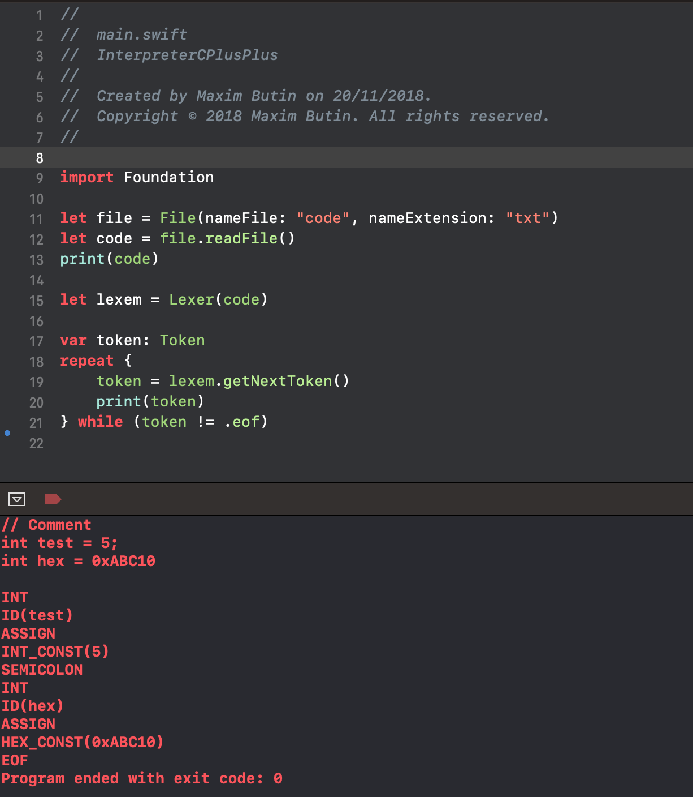

# InterpreterCPP

Простой интетпретатор языка C++, написанный на языке Swift. 
При написании данного приложения пользуюсь 
* [github'ом Игоря Кулмана](https://github.com/igorkulman/SwiftPascalInterpreter)
* [блогом Руслана](https://ruslanspivak.com/lsbasi-part1/)
* [Ссылочкой с сайта Tproger](https://tproger.ru/translations/how-to-create-programming-language/)

## Что надо реализовать
Программа: 
1. **Главная программа языка C++**
2. **Допускается описание функций с параметрами, возвращающие значения**
3. **Типы данных:** 
  * bool 
  * int 
4. **Операции:**
  * Простейшие арифметические операции 
  * Сравнения 
  * Логические 
5. **Операторы:**
  * Присваивание 
  * switch 
  * return
6. **Операнды:**
  * Простые переменные 
  * Константы
7. **Константы:**
  * Целые 10с/с
  * Целые 16с/с
  * Логические

## Что реализовано
**Лексер**
Лексер читает программу С++ как строку(последовательность символов) и преобразует ее в последовательность [токенов](https://github.com/butinmv/InterpreterCPP/blob/master/InterpreterCPP/Lexer/Token.swift). 
Вы можете увидеть результат,в [модульных тестах](https://github.com/butinmv/InterpreterCPP/blob/master/InterpreterCPPTesting/LexerTester.swift).

